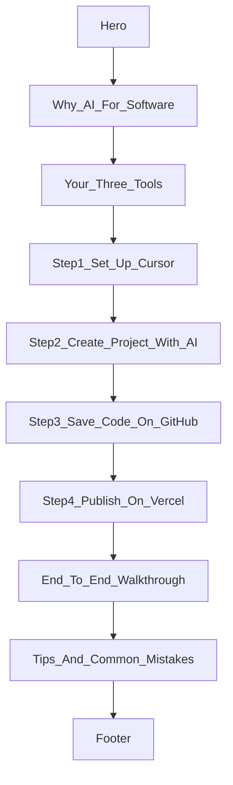

# One-Page AI Teaching Website Plan

## Goal

Create a **single scrollable page** that teaches **non-technical beginners** how to build software using AI, centered on your stack:

| Role | Tool |
|------|------|
| AI coding agent | **Cursor** |
| Code storage | **GitHub** |
| Website hosting | **Vercel** |

The site itself is built **with the same tools it teaches** — a practical meta-example.

---

## Your choices (confirmed)

- **Audience:** Non-technical beginners
- **Content focus:** End-to-end Cursor + GitHub + Vercel workflow
- **Interactivity:** Mostly static — sections, steps, screenshot placeholders, external links

---

## Recommended site stack

| Layer | Choice |
|-------|--------|
| Framework | **Next.js (App Router)** |
| Styling | **Tailwind CSS** |
| Language | **TypeScript** |
| Hosting | **Vercel** (auto-detects Next.js) |
| Repo | **GitHub** |

No backend, database, or auth for v1.

### Scaffold note

The folder name `AIP-1` contains capital letters, which breaks `create-next-app` at the root. Scaffold into a lowercase subfolder (e.g. `aip-1-site`), then move files to the workspace root.

---

## Page information architecture

One long page with a **sticky top nav** linking to anchored sections. Plain language throughout — define terms on first use.



### Section content

1. **Hero** — *"Build a website with AI — even if you've never coded"* + 3 outcomes + CTA scroll to Step 1
2. **Why AI for software building** — AI as pair-programmer; review and approve changes; good prompts
3. **Your three tools** — Cards for Cursor, GitHub, Vercel
4. **Step 1: Set up Cursor** — Download, account, open folder; screenshot placeholder; link to cursor.com
5. **Step 2: Create your project with AI** — Example prompt in code block; accept/review/follow-up; screenshot placeholder
6. **Step 3: Save code on GitHub** — Account, new repo, git commands; commit/push analogies; link to github.com
7. **Step 4: Publish on Vercel** — Import repo, deploy, live URL; auto-redeploy; link to vercel.com
8. **End-to-end walkthrough** — Idea → Cursor → GitHub → Vercel → Share link
9. **Tips and common mistakes** — Specific prompts, no secrets, paste errors, save often
10. **Footer** — Links to Cursor, GitHub, Vercel; *Built with Cursor + deployed on Vercel*

---

## Project file structure

```
AIP-1/
├── app/
│   ├── layout.tsx
│   ├── page.tsx
│   └── globals.css
├── components/
│   ├── Header.tsx
│   ├── Hero.tsx
│   ├── WhySection.tsx
│   ├── ToolsSection.tsx
│   ├── ToolCard.tsx
│   ├── StepSection.tsx
│   ├── CodeBlock.tsx
│   ├── ScreenshotPlaceholder.tsx
│   ├── WorkflowWalkthrough.tsx
│   ├── TipsSection.tsx
│   └── Footer.tsx
├── public/images/
├── README.md
├── DEPLOY.md
├── PLAN.md
├── package.json
└── next.config.ts
```

---

## Visual design

- **Layout:** `max-w-3xl mx-auto`, generous whitespace
- **Typography:** Geist via `next/font`
- **Color:** Light background, indigo accent for CTAs and step numbers
- **Accessibility:** One `h1`, semantic headings, alt text on images
- **Mobile-first:** Stacked nav links on small screens

---

## Implementation phases

### Phase 1 — Scaffold
- Next.js + TypeScript + Tailwind in `AIP-1`

### Phase 2 — Build sections
- All section components with beginner copy
- Anchor IDs: `#step-1` … `#step-4`, `#walkthrough`, `#tips`

### Phase 3 — Polish
- Metadata + Open Graph tags
- Responsive spacing and mobile nav
- README

### Phase 4 — GitHub
- `git init`, commit, push to GitHub (see [DEPLOY.md](DEPLOY.md))

### Phase 5 — Vercel
- Import GitHub repo, deploy, verify live URL (see [DEPLOY.md](DEPLOY.md))

---

## Implementation progress

| Task | Status |
|------|--------|
| Scaffold Next.js + TypeScript + Tailwind | Done |
| Section components + page content | Done |
| Sticky header, nav, metadata | Done |
| Screenshot placeholders | Done |
| Production build (`npm run build`) | Done |
| Local dev server (`npm run dev`) | Done |
| GitHub push | Done — [github.com/buntyraj-pts/ai-software-building-guide](https://github.com/buntyraj-pts/ai-software-building-guide) |
| Vercel deploy | Pending — manual; see [DEPLOY.md](DEPLOY.md) |

**All 11 components implemented.** Site runs at `http://localhost:3000` during dev.

---

## Content assets (add later)

Replace gray screenshot placeholders with real images in `public/images/`:

- Cursor IDE with chat open
- New project / file tree
- GitHub new repository screen
- Git commit/push in Cursor
- Vercel import project
- Vercel successful deployment

---

## Out of scope for v1

- Multi-page site, CMS, or blog
- User accounts, backend API, analytics dashboard
- Video embeds, dark mode, i18n, interactive quiz/checklist

---

## Success criteria

- [x] Single page loads fast on mobile and desktop
- [x] A beginner can follow Steps 1–4 without external docs
- [ ] GitHub repo is public with a clear README
- [ ] Site is live on a Vercel URL
- [ ] The page demonstrates the workflow it teaches

**Estimated remaining effort:** ~15 min (GitHub push + Vercel deploy)
